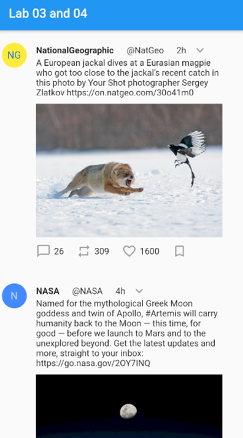

# Lab 03/04
The starter code for lab 03-04.

## Overview
Let's design the user interface of a single page of a Twitter app in Flutter.

_**Note:** This lab is designed to take 2 weeks, and will be worth the value of two lab assignments.  It is recommended that you do the overall layout in the first week, and use basic widgets (introduced last week) as placeholders (e.g. `Text()`).  You can fill in the correct widgets in the second week._

## Instructions

### Layout Design
Head to Twitter and check out the interface for the main stream page.  Below is an example (image) post:

_Figure 1 - A single Tweet_

First, we need to determine the layout from the largest elements to the smallest.  Can you see any structure at the top-most level?

A marked-up screenshot is presented below.  For those columns, try to come up with a structure using the same technique.

 
_Figure 2 - The Tweet can be broken down into two columns_

The tweet can be broken down into two columns.  We can represent this using a `Row` widget.  The first column is pretty simple; it merely has a single user avatar (we can use `CircleAvatar` for this).  The second column needs to be examined further.  Apply the same process to the second column, and repeat until you have fully designed the UI.

Create a new class, `TweetWidget`, that takes each of the elements (`userShortName`, `userLongName`, `timeString`, `description`, `imageURL`, `numComments`, `numRetweets`, and `numLikes`) as constructor arguments.  Let's ignore links for this example.  The `Tweet` class should have a `build()` method that returns a (`Row`) widget with all of the content contained within the widget tree, such that it resembles the above screenshot. 

### Choosing the Correct Widgets and Adding Content
To make your job easier, the icons needed have been listed in the table, below.  These will be `IconButtons`, but you won't have to handle them being toggled/clicked.  In fact, none of the interaction elements of this page are required for this lab assignment.

Icon | Description
---- | -----------
Icons.expand_more | The menu on the top right of the tweet
Icons.chat_bubble_outline | The number of comments
Icons.repeat | The number of re-tweets
Icons.favorite_border | The number of likes
Icons.bookmark_border | For sharing the tweet

Use some placeholder data, and your new `Tweet` class, to generate a `ListView` of a few tweets, to observe your design.  The same placeholder data can be used in all of the tweets, if you'd like.  Don't worry too much about the font family of your text, and you also will not have to shorten longer numbers (1648 -> 1.6k).  The menu icon is expected to be right-justified, but that is more advanced UI layout than we are ready for.  Instead, you can left-justify it like shown in the sample, below.

The main image will be loaded from some online source.  Use any image(s) that you have the rights/permission to use.

Below, you will see the sample output that is expected of you.

_Figure 3 - The app's output, showing two tweets_

## Getting Help
If you run into difficulty, you may wish to check out some of the following resources:

- https://api.flutter.dev/  - The standard documentation for Flutter, all classes and methods.
- https://dart.dev/tutorials - A series of tutorials for the Dart programming language, focusing entirely on the features of Dart.
- https://flutter.dev/docs/reference/tutorials - A series of tutorials for the Flutter platform, focusing mainly on the widgets and API.
- https://flutter.dev/docs/codelabs - A series of deep-dive, more comprehensive, tutorials to learn more about the Flutter platform.
- https://flutter.dev/docs/cookbook - A set of recipes for commonly used features of Flutter.
- https://github.com/flutter/samples/ - A repository containing some completed Flutter applications.
- http://stackoverflow.com/ - A forum for asking questions about programming.  I bet you know this one already!

Of course, you can always ask the TA for help!  However, learning how to find the answers out for yourself is not only more satisfying, but results in greater learning as well.

## How to Submit
Create your flutter project inside this folder, commit, and then push your code to this repository to submit your lab assignment.

## Extending
If you wish to extend this lab, you will need to add features including interaction for elements in the application.

- Add a button to the AppBar that takes users to a new page where they can create a new tweet. This will require them to specify their two names, the text of the tweet, and an optional link to an image. New tweets are created with 0 comments, retweets, and likes, and are timestamped at the time of their creation.

  - This means you will need to modify your app to use timestamps instead of timestrings to indicate when a tweet was made. Do so.

- Clicking the heart (Like) or retweet buttons should increase the counts by 1, and change their icons appropriately. Clicking a second time should return the count and icons to their original states.

- Clicking the button next to the time string should provide a small popup that asks the user if they wish to hide the tweet. If they do so, the tweet should disappear from the feed.

- Clicking the speech bubble should provide the opportunity to reply to a tweet. This should take the user to a new page where they can write a new tweet. If a tweet is submitted, it should appear in the feed directly below the original tweet, and increase the number of comments by 1.

- Clicking the bookmark button should set the tweet to be a favorited tweet. Favorited tweets will always appear at the top of the feed, with any replies directly below them. Clicking the bookmark button a second time should cause the tweet to no longer be favorited.

- Access Twitter.com directly to generate the initial tweets that appear when starting the app. You can choose any random tweets you want, and you don't need to actually interact with the real tweets, but you should be able to retrieve their information and use that to populate your feed.

- Add one more feature of your choice other than those listed here. Mention this feature explicitly in your README.md.
